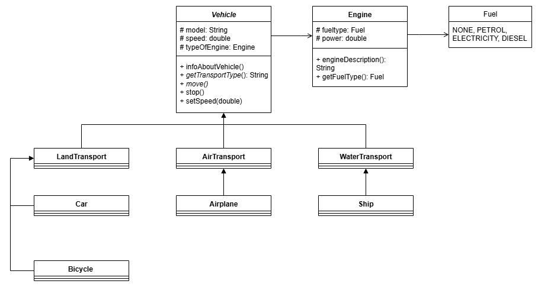

# Java Backend Course

This repository contains my homework assignments for the Java Backend course.

# Task 3

В рамках данного задания была создана иерархия классов для описания нескольких видов транспорта.

## Основные классы
### `Vehicle`
Абстрактный класс для всех видов транспорта.
Поля:
- `model` - модель;
- `speed` - скорость;
- `typeOfEngine` - двигатель.

Методы:
- `infoAboutVehicle()` - вывод информации о транспортном средстве;
- `getTransportType()` - получение типа транспорта;
- `move()` - запуск транспортного средства;
- `stop()` - остановка транспортного средства;
- `setSpeed(double newSpeed)` - изменение скорости транспортного средства.

### Подклассы
- `AirTransport` - воздушный транспорт;
- `WaterTransport` - водный транспорт; 
- `LandTransport` - наземный транспорт.
Запечатанные классы.

### Конечные классы
- `Car` - автомобиль;
- `Bicycle` - велосипед;
- `Ship` - корабль;
- `AirPlane` - корабль.

### Дополнительные классы
- `Ship` - двигатель;
- `Fuel` - топливо (бензин, электричество, дизель, нет топлива).

Ниже приведена UML-диаграмма реализованной иерархии.
